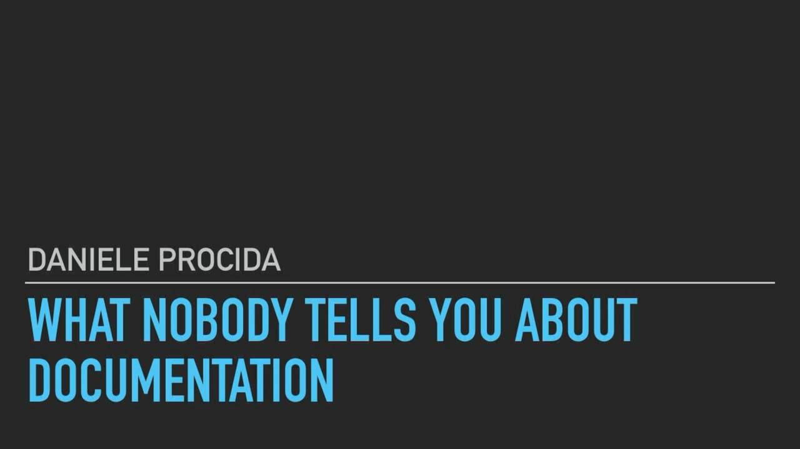

```{r setup, include=FALSE}
options(htmltools.dir.version = FALSE)
```

```{r xaringan-themer, include=FALSE, warning=FALSE}
library(xaringanthemer)
style_solarized_light(
  base_font_size = "32px", 
  header_h1_font_size = "2.0rem",
  header_h2_font_size = "1.5rem",
  header_h3_font_size = "1.25rem", 
  header_background_content_padding_top = "2rem", 
  header_font_google = google_font("Lato"),
  text_font_google   = google_font("Montserrat", "300", "300i", "500"),
  code_font_google   = google_font("Source Code Pro", "300", "500"), 
  extra_css = list("p" = list("margin-block-start" = "0.5em", 
                              "margin-block-end" = "0.5em"), 
                   "ul" = list("margin-block-start" = "0.5em", 
                              "margin-block-end" = "0.5em"), 
                   "li" = list("margin-block-start" = "0.5em", 
                              "margin-block-end" = "0.5em"), 
                   "pre" = list("margin-top" = "0.5em", 
                              "margin-bottom" = "0.5em"), 
                   ".small" = list("font-size" = "80%"), 
                   ".tiny" = list("font-size" = "50%"), 
                   ".vmiddle" = list("transform" = "translateY(-100%)")), 
  link_color = "#339944"
)
```
class: inverse, center, middle

# `r desc::desc_get('Title', '..')`
### `r rmarkdown::metadata$author`
### Health Science Center Libraries
### University of Florida
### (updated: `r Sys.Date()`)

---
You have a project on GitHub.

--

### .center[🎉 Congrats! 🎉]

--

How do you get people to engage with it?

--

* **What** problem does it solve?
* **Who** is the project for?
* **How** does a user install it?
* **Where** does someone go to find more info?

---
# Prerequisites

This lesson assumes you:
`r gsub("\n ", "\n", desc::desc_get("prerequisites"))`

---
# Learning Outcomes

By the end of the workshop, participants will be able to:

`r gsub("\n ", "\n", desc::desc_get("learningOutcomes"))`

---
class: inverse, center, middle

# Documentation Types

---
Daniele Procida talks about the **4** kinds of documentation with **different purposes** and requiring **different approaches**.

```{r, echo = FALSE, out.width = "70%", fig.align = "center", fig.alt = "A title slide of a dark grey background with the title 'What nobody tells you about documentation' in light blue text at the bottom of the slide. Just above the title is a horizontal light gray line and above that the presenter's name: 'Daniele Procida'."}

```
.center[[PyCon Australia 2017 talk](https://www.youtube.com/watch?v=t4vKPhjcMZg)]

---
class: split-two with-thick-border
.column[
.split-two[
  .row[.content.vmiddle.center[
    ### TUTORIALS
  ]]
  .row[.content.vmiddle.center[
    ### EXPLANATION
  ]]
]]
.column[
.split-two[
  .row[.content.vmiddle.center[
    ### HOW-TO GUIDES
  ]]
  .row[.content.vmiddle.center[
    ### REFERENCE
  ]]
]]

---
class: inverse, center, middle

# User Personas

---
# Definition

*Personas* are descriptions of imaginary users, to help guide the design of your project.

--

A *good* persona includes:
* background knowledge and experience
* motivations and needs
* concerns and barriers

---
class: center, middle

# Exercise

---
class: inverse, center, middle

# README Structure

---
# Structuring a How-To Guide


---

# Get ~~students~~ users doing powerful things quickly

Examples:
* Work with real and interesting data
* Create appealing and informative visualizations
* Draw useful conclusions

.small[adapted from [David Robinson's blogpost](http://varianceexplained.org/r/teach-tidyverse/)]

---
# Examples

[The `datapasta` R package](https://github.com/milesmcbain/datapasta/).

---
class: inverse, center, middle

# Takeaways

---
1. Know your users and what they need
2. Get  users doing powerful things quickly
  *Explanations get in the way of action.*
3. Watch out for jargon!


```{r, echo = FALSE, out.width = "70%", fig.align = "center", fig.alt = "A clip from Schitt's Creek. A white male in his 30s in a white sweater with black stripes and a blue apron with pink flowers is stirring a pot in the kitchen. His mother, a white female in her 60s in a black dress and glasses is holding a small piece of paper, intended to be a recipe of some kind. The man has a skeptical look and is asking 'What does \"Fold in the cheese\" mean?'. The dialogue also appears in the clip as a caption."}
knitr::include_graphics("fold-in-the-cheese.gif")
```

